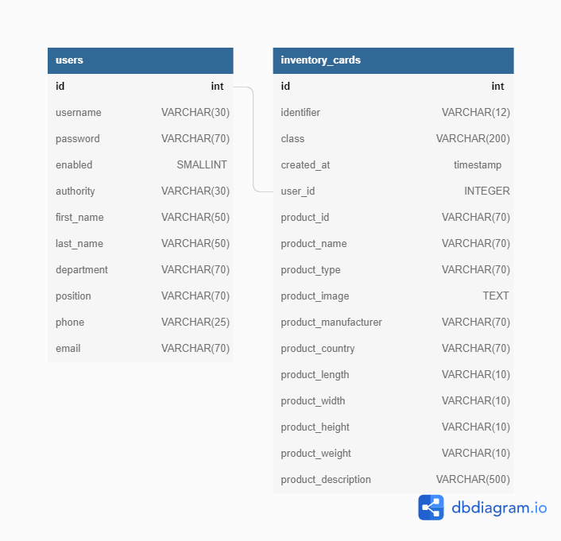
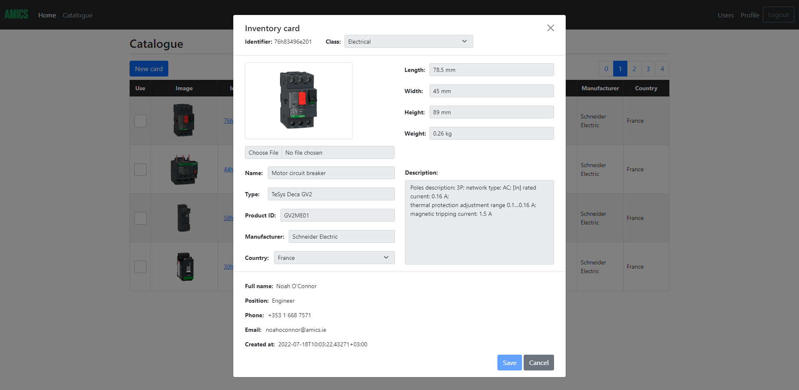

# AMICS
AMICS (Advanced Manufacturing Inventory Control System).
This project is based on a production application that is actively used at several manufacturing plants.
There are far less functionality that the real application has, but some of it is presented in the project.

## About The Project

### How It Works
Roughly speaking, the process looks like this:
1. An employee initiates a purchasing process and makes a request for budget approval for a desired product.
2. When everything is approved, it is time for creating a new inventory card with full information about the product in an e-catalogue of the ICS (inventory control system).
3. After that, the employee makes a PR (purchase requisition) in an ERP (enterprise resource planning) system which is connected to the ICS.
4. A specialist from the Purchasing Department checks the PR and organize further steps of the purchasing process.
5. At the end, when the product is purchased and delivered, it must be registered in the ERP system.

Each employee of the organization who has access to the ICS can view all equipment, accessories, tools and materials registered in the catalogue.
It is very useful to do before your own purchasing as it might help to find a product similar to what you need that has been already purchased.
Instead of long searching in the Internet you can contact with your colleague who created a card with a desired product and discuss its quality, characteristics, vendors, prices etc.
In case the product is exactly what is needed you just skip creation of a new inventory card and go to the next step.
If the product has similar characteristics you can reuse an existing inventory card with small changes.
Both cases will definitely save your time and speed up the process.

### What We Have So Far
Currently the application has only one main functionality which is to register equipment and accessories of specific categories
(Air conditioning, Electrical, Electronics, Gas, Heating, Hydraulics, Mechanical, Ventilation).

### Organizational Chart
The diagram shows the structure of an organization with departments, employees and their roles.


There are three roles with authorities used:
1. [ROLE_ADMIN]: create/view/reuse inventory cards, create/view/update/delete users, view/update profile.
2. [ROLE_MASTER]: create/view/reuse/delete inventory cards, view/update profile.
3. [ROLE_USER]: create/view/reuse inventory cards, view/update profile.

### Built With

* Spring Boot
* Spring Data JPA
* Spring Security
* Thymeleaf
* Bootstrap
* JQuery
* PostgreSQL
* Flyway
* Docker

### Database Diagram


## Getting Started

### Prerequisites
The following items should be installed in your system:
* JDK 17 or newer
* Eclipse IDE
* Git command line tool (https://help.github.com/articles/set-up-git)
* Docker (https://docs.docker.com/get-docker)

### Steps

1) On the command line:

```bash
	git clone https://github.com/vl-blinov/spring-inventory-control-system.git
```
2) Inside Eclipse IDE:

```
	File -> Import -> Maven -> Existing Maven Projects
```
3) On the command line in the project root directory:

```bash
	docker-compose up
```
4) Inside Eclipse IDE:

```
	src/main/java/ru.blinov.control.inventory/InventoryControlSystemApplication.java -> Run As -> Java Application
```

5) Navigate to AMICS:

```
	Visit [http://localhost:8080] in your browser
```

6) Log in as one of the following users (password: "123" for everyone):

| #  | Username         | Role        | 
| -- | ---------------- | ----------- |
| 1  | jackobrien  		| ROLE_ADMIN  |
| 2  | gracecarrol 		| ROLE_MASTER |
| 3  | danielcollins    | ROLE_USER   |

7) Explore the application:



## Important Notes

1. Spring Security is used per se only for authorization.
A password for all existing and newly created users is "123" by default.
2. Postgres database runs inside of a docker container after "docker-compose up" command is executed.
There is no need to install it locally.
3. A separate test container with database is launched during the tests where required.
4. Schema and data migration is implemented automatically by Flyway.
5. The images resource directory "src/main/resources/images/" is cleared out and then populated with images 
from "src/main/resources/static/images-source/" images source directory before each running of the SpringApplication.

## Acknowledgements

* [Spring & Hibernate Course](https://www.udemy.com/course/spring-hibernate-tutorial)
* [PostgreSQL Course](https://www.udemy.com/course/sql-and-postgresql)
* [Baeldung](https://www.baeldung.com)
* [Bootstrap](https://getbootstrap.com)
