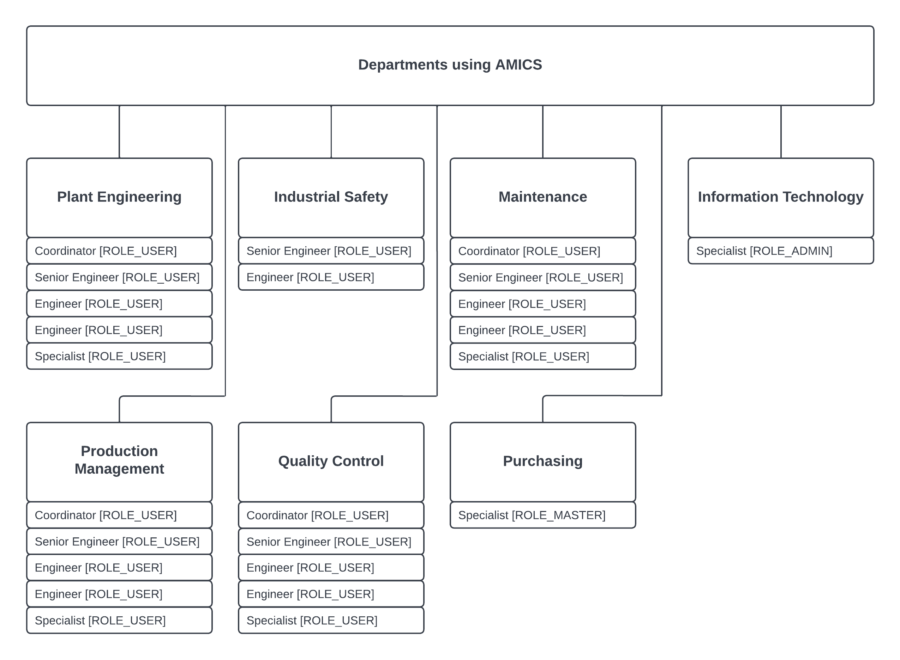

# AMICS
AMICS (Advanced Manufacturing Inventory Control System).
This pet-project is based on a production application that is actively used at several manufacturing plants.
There are far less functionality that the real application has, but some of it are presented in this project.

## About The Project

### How It Works In Production

### What We Have So Far
Currently the application has only one main functionality which is to register all equipment and accessories
that will be purchased for further use at a manufacturing plant.

### Organization Structure
The chart shows an organization structure with departments using inventory control system.

There are three authorities used:
1.[ROLE_ADMIN]
1.[ROLE_MASTER]
1.[ROLE_USER]

## Getting Started

## Acknowledgements

